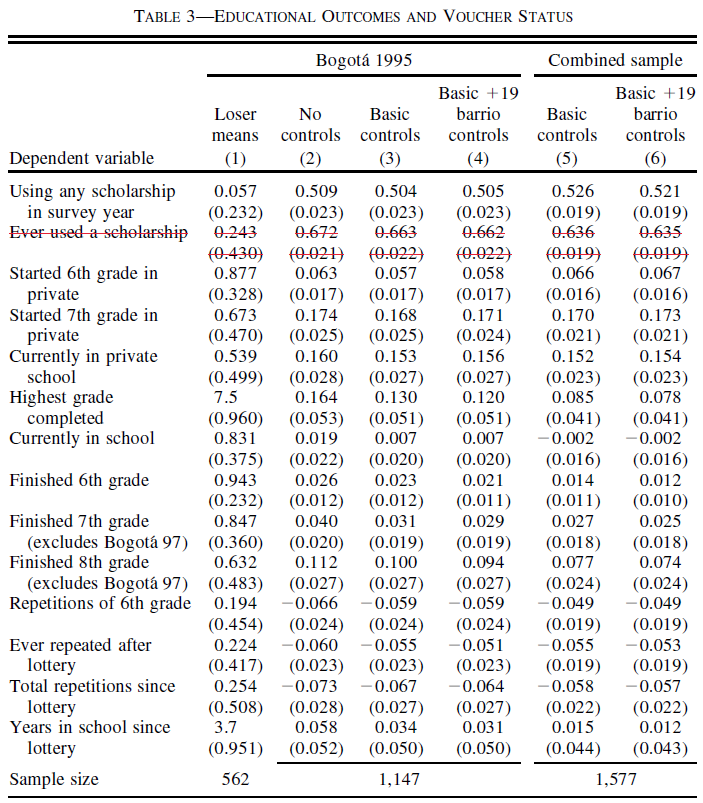

```{r setup, include=FALSE}
knitr::opts_chunk$set(echo = TRUE)
```

# Part 1: Does Price Matter in Charitable Giving? Evidence from a Large-Scale Natural Field Experiment replication

In this post we will Conduct a replication study based on one of the datasets included in the experimentdatar package, and than perform a further analysis on the heterogenity of the treatment effect in the paper. 

### The experimentdatar data package

The experimentdatar data package contains publicly available
datasets that were used in Susan Athey and Guido Imbens' course "Machine Learning and Econometrics" (AEA continuing Education, 2018). let's install the package:

```{r , echo=TRUE, warning=FALSE, results=FALSE}
#install.packages("dplyr", repos = "http://cran.us.r-project.org", dependencies = TRUE)
#install.packages("devtools", repos = "http://cran.us.r-project.org")
library(devtools)
#devtools::install_github("itamarcaspi/experimentdatar")
library(experimentdatar)
data(vouchers)
dat <- vouchers
```

### About the paper

The chosen dataset is vouchers, which is used for the paper for the paper "Vouchers for Private Schooling in Colombia: Evidence from a Randomized Natural Experiment" by Angrist, Bettinger, Bloom, King, and Kremer (2002).

The paper had several results:

"Colombia used lotteries to distribute vouchers which partially covered the cost of private secondary school for students who maintained satisfactory academic progress. Three years after the lotteries, winners were about 10 percentage points more likely to have finished 8th grade, primarily because they were less likely to repeat grades, and scored 0.2 standard deviations higher on achievement tests. There is some evidence that winners worked less than losers and were less likely to marry or cohabit as teenagers. Benefits to participants likely exceeded the $24 per winner additional cost to the government of supplying vouchers instead of publics chool places. (JEL I22, J13, I28)"
...
This paper presents evidence on the impact of one of the largest school voucher programs to date, the Programa de Ampliacio´n de Cobertura de la Educacio´n Secundaria (PACES), a Colombian initiative that provided over 125,000 pupils with vouchers covering somewhat more than half the cost of private secondary school. Vouchers were renewable as long as students maintained satisfactory academic performance.
...
The test results suggest that, on average, lottery winners scored about 0.2 standard deviations higher than losers, a large but only marginally significant difference. The effect on girls is larger and more precisely estimated than the effect on boys.
...
A number of channels could potentially account for the PACES program’s effects on participants. The program clearly shifted some participants from public to private school, and pupils who shifted may have benefitted from the opportunity to attend private schools. There is also evidence that some pupils who would have attended private school anyway were able to attend more expensive private schools. Finally, voucher recipients may have had greater incentives to focus on school because vouchers could
only be renewed for those pupils who did not repeat grades.
...
There is little evidence of any association between win/loss status and the individual
characteristics measured in our data from Bogota´, although winners and losers are less
comparable in the 1993 Jamundi cohort. 
...
The estimates of lottery effects are based on the following regression model: 

$$ y_{ic} =  X'_i\beta_0 + \alpha_0 Z_i + \delta_c + \varepsilon_{ic}$$
where $y_{ic}$ is the dependent variable for child i from application cohort c (defined by city and year); $X_i$ represents a vector of individual and survey characteristics like $age, sex,$ and whether the survey was $telephone$ or in person; $\Zi$ is an indicator for whether child i won the voucher lottery; and $\delta_c$ is an applicant cohort effect to control for the fact that the probability of winning
varied by city and year. The coefficient of interest is $\alpha_0$. The researches estimated (1) using three sets of control variables: “no controls,� i.e., excluding
the Xi variables; “basic controls� including the Xi variables; and “basic plus barrio controls� which includes the $X_i$ variables plus 19 neighborhood dummies in the Bogota´-95 sample.

The regression estimates are from models that include controls for city, year of application, phone access, age, type of survey and instrument, strata of residence, and
month of interview.

## Replicating Table 3: EDUCATIONAL OUTCOMES AND VOUCHER STATUS

Table 3 is replicated using published SAS program for table 3 in the Angrist Data Archive on the mit economics website:
http://economics.mit.edu/faculty/angrist/data1/data/angetal02 

### An Important Warning about the accuary of the dataset and the estimation

First, as mentioned in the website above, "...these files do not always produce an exact match to the 2002 results". As you'll see below, the number of observations is not correct, even though we used the exact same subsets of data in the SAS programs. Even though, it appears the estimated depentendts in this post are quite close to the original ones.
Also, There was no exact indication which program variables fit which table dependent variables, and so the variables were identified using variables names, types (binary or not) and outcome values, as follows:
SCYFNSH	- Highest grade completed,
INSCHL	- Currently in school,
FINISH6	- Finished 6th grade,
FINISH7	- Finished 7th grade,
FINISH8	- Finished 8th grade,
PRSCHA_1 - Started 6th grade in private school,
PRSCHA_2 - Started 7thgrade in private school,
PRSCH_C	- Currently in private school,
NREPT	  - Ever repeated after lottery,
REPT6	  - Repetitions of 6th grade,
TOTSCYRS -	Years in school since lottery,
STRATAMS - Total repetitions since lottery (the difference between the outcomes below and the outcomes in the paper suggests it is not a correct identificication of the variable),
USNGSCH	- Using any scholarship in survey year.
Lastly, "The Ever used a scholarship"" dependent variable, which assumed to be USESCH in the table 7 program, appears to be missing from the assigned vouchers dataset and therefore is ommited from the list of dependents.

### create the table 3 dataset:

1) Keep observations from the Bogota 95,97 or Jamundi 93 samples only
2) Keep the relavent 37 variables + 12 months of interview + 19 barrio (neigborhoods) variables
3) sort dat_table3 dataset by VOUCH0, a binary for receiving the treamtment { 1 for winning a voucher, 0 for loosing).

```{r, echo=TRUE,message=FALSE, warning=FALSE, results=FALSE}
dat_table3<-subset(dat, (BOG95SMP==1 | BOG97SMP==1 | JAM93SMP==1))
dat_table3<-dat_table3[c("ID","VOUCH0","BOG95SMP","BOG97SMP","JAM93SMP","AGE2","SCYFNSH","INSCHL","FINISH6","FINISH7","FINISH8","PRSCHA_1","PRSCHA_2","PRSCH_C","REPT6","REPT","NREPT","TOTSCYRS","USNGSCH","SVY","HSVISIT","DJAMUNDI","PHONE","AGE","SEX2","DBOGOTA","D1993","D1995","D1997","DMONTH1","DMONTH2","DMONTH3","DMONTH4","DMONTH5","DMONTH6","DMONTH7","DMONTH8","DMONTH9","DMONTH10","DMONTH11","DMONTH12","STRATA1","STRATA2","STRATA3","STRATA4","STRATA5","STRATA6","STRATAMS","DAREA1","DAREA10","DAREA11","DAREA12","DAREA13","DAREA14","DAREA15","DAREA16","DAREA17","DAREA18","DAREA19","DAREA2","DAREA3","DAREA4","DAREA5","DAREA6","DAREA7","DAREA8","DAREA9","SEX_MISS")]
sort(dat_table3$VOUCH0)
```

## 1. The 'Bogota 95 Losers (1)' means column:


Using a  "Bogota_95_Losers" subset of the data:

```{r, echo=TRUE,message=FALSE, warning=FALSE}
Bogota_95_Losers <- subset(dat_table3, VOUCH0==0 & BOG95SMP==1)
#detach(dat_table3)
attach(Bogota_95_Losers)
df <- data.frame()
options(digits=3)
means_sd_n <- c(round(mean(SCYFNSH,na.rm = TRUE),digits = 3),paste("(",round(sd(SCYFNSH,na.rm = TRUE),digits = 3),")"),round(mean(INSCHL,na.rm = TRUE),digits = 3),paste("(",round(sd(INSCHL,na.rm = TRUE),digits = 3),")"),round(mean(FINISH6,na.rm = TRUE),digits = 3),paste("(",round(sd(FINISH6,na.rm = TRUE),digits = 3),")"),round(mean(FINISH7,na.rm = TRUE),digits = 3),paste("(",round(sd(FINISH7,na.rm = TRUE),digits = 3),")"),round(mean(FINISH8,na.rm = TRUE),digits = 3),paste("(",round(sd(FINISH8,na.rm = TRUE),digits = 3),")"),round(mean(PRSCHA_1,na.rm = TRUE),digits = 3),paste("(",round(sd(PRSCHA_1,na.rm = TRUE),digits = 3),")"),round(mean(PRSCHA_2,na.rm = TRUE),digits = 3),paste("(",round(sd(PRSCHA_2,na.rm = TRUE),digits = 3),")"),round(mean(PRSCH_C,na.rm = TRUE),digits = 3),paste("(",round(sd(PRSCH_C,na.rm = TRUE),digits = 3),")"),round(mean(REPT6,na.rm = TRUE),digits = 3),paste("(",round(sd(REPT6,na.rm = TRUE),digits = 3),")"),round(mean(NREPT,na.rm = TRUE),digits = 3),paste("(",round(sd(NREPT,na.rm = TRUE),digits = 3),")"),round(mean(TOTSCYRS,na.rm = TRUE),digits = 3),paste("(",round(sd(TOTSCYRS,na.rm = TRUE),digits = 3),")"),round(mean(STRATAMS,na.rm = TRUE),digits = 3),paste("(",round(sd(STRATAMS,na.rm = TRUE),digits = 3),")"),round(mean(USNGSCH,na.rm = TRUE),digits = 3),paste("(",round(sd(USNGSCH,na.rm = TRUE),digits = 3),")"),nrow(Bogota_95_Losers))
df <- means_sd_n
table_3<-`.rowNamesDF<-`(df,make.names=TRUE,c("Highest grade
completed","sd","Currently in school","sd","Finished 6th grade","sd","Finished 7th grade
(excludes Bogota´ 97)","sd","Finished 8th grade
(excludes Bogota´ 97)","sd","Started 6th grade in
private","sd","Started 7th grade in
private","sd","Currently in private
school","sd","Repetitions of 6th grade","sd","Ever repeated after
lottery","sd","Years in school since
lottery","sd","Total repetitions since
lottery","sd","Using any scholarship
in survey year","sd","Sample Size"))
table_3 <- data.frame(table_3)
# Rename the column:
detach(Bogota_95_Losers)
```

## 2. The estimated effects of winning a voucher columns

fit a regression model for the dependent variables, and for each column (model) obtain both the estimated effect of winning a voucher on the dependent estimates and the standard error from the heteroscedasticity-corrected covariance matrix:

### The 'Combined - Basic controls (5)' column:

```{r, echo=TRUE,message=FALSE, warning=FALSE}
#install.packages("car", repos = "http://cran.us.r-project.org")
library(car)
attach(dat_table3)
# The list of dependents (FINISH7-8 will be estimated again excluding bogota 97):
df_dependents <- data.frame(SCYFNSH,INSCHL,FINISH6,FINISH7,FINISH8,PRSCHA_1,PRSCHA_2,PRSCH_C,REPT6,REPT,NREPT,TOTSCYRS,USNGSCH)
# The new table column:
table_3 <- cbind(table_3, "Combined basic controls"=0)
table_3 <- data.frame(table_3)
options(digits=3)
# Run all models:
for (i in 1:length(df_dependents)){
  model <- lm(formula = df_dependents[,i] ~ VOUCH0 + SVY + HSVISIT + DJAMUNDI + PHONE + AGE + SEX2 + STRATA1 + STRATA2 + STRATA3 + STRATA4 + STRATA5 + STRATA6 + STRATAMS + DBOGOTA + D1993 + D1995 + D1997 + DMONTH1 + DMONTH2 + DMONTH3 + DMONTH4 + DMONTH5 + DMONTH6 + DMONTH7 + DMONTH8 + DMONTH9 + DMONTH10 + DMONTH11 + DMONTH12 + SEX_MISS, data = dat_table3)
  # The estimated effect of Winning a voucher on the dependent:
  vouch0_effect <- model$coefficients["VOUCH0"]
  vouch0_effect <- round(vouch0_effect, digits = 3)
  table_3[i*2-1,"Combined.basic.controls"] <- vouch0_effect
  # The heteroscedasticity-corrected covariance matrix:
  vcov <- data.frame(hccm(model, type = "hc0"))
  # Obtain the standart error of the dependent, as they are given by the square root of the element in the main diagonal of the matrix:
  vouch0_se <- sqrt(vcov["VOUCH0","VOUCH0"])
  vouch0_se <- paste("(",round(vouch0_se, digits = 3),")")
  table_3[i*2,"Combined.basic.controls"] <- vouch0_se
}
table_3["Sample.Size","Combined.basic.controls"] <- nobs(model)

## Calculating FINISH7-8 from the Bogota97 excluded data subset:

# FINISH7:
Bogota_97_excluded <- subset(dat_table3, (BOG95SMP==1 | JAM93SMP))
model <- lm(formula = FINISH7 ~ VOUCH0 + SVY + HSVISIT + DJAMUNDI + PHONE + AGE + SEX2 + STRATA1 + STRATA2 + STRATA3 + STRATA4 + STRATA5 + STRATA6 + STRATAMS + DBOGOTA + D1993 + D1995 + D1997 + DMONTH1 + DMONTH2 + DMONTH3 + DMONTH4 + DMONTH5 + DMONTH6 + DMONTH7 + DMONTH8 + DMONTH9 + DMONTH10 + DMONTH11 + DMONTH12 + SEX_MISS, data = Bogota_97_excluded)
vouch0_effect <- model$coefficients["VOUCH0"]
vouch0_effect <- round(vouch0_effect, digits = 3)
table_3["Finished.7th.grade..excludes.Bogota..97.","Combined.basic.controls"] <- vouch0_effect
vcov <- data.frame(hccm(model, type = "hc0"))
vouch0_se <- sqrt(vcov["VOUCH0","VOUCH0"])
vouch0_se <- paste("(",round(vouch0_se, digits = 3),")")
table_3["sd.3","Combined.basic.controls"] <- vouch0_se
# FINISH8:
model <- lm(formula = FINISH8 ~ VOUCH0 + SVY + HSVISIT + DJAMUNDI + PHONE + AGE + SEX2 + STRATA1 + STRATA2 + STRATA3 + STRATA4 + STRATA5 + STRATA6 + STRATAMS + DBOGOTA + D1993 + D1995 + D1997 + DMONTH1 + DMONTH2 + DMONTH3 + DMONTH4 + DMONTH5 + DMONTH6 + DMONTH7 + DMONTH8 + DMONTH9 + DMONTH10 + DMONTH11 + DMONTH12 + SEX_MISS, data = Bogota_97_excluded)
vouch0_effect <- model$coefficients["VOUCH0"]
vouch0_effect <- round(vouch0_effect, digits = 3)
table_3["Finished.8th.grade..excludes.Bogota..97.","Combined.basic.controls"] <- vouch0_effect
vcov <- data.frame(hccm(model, type = "hc0"))
vouch0_se <- sqrt(vcov["VOUCH0","VOUCH0"])
vouch0_se <- paste("(",round(vouch0_se, digits = 3),")")
table_3["sd.4","Combined.basic.controls"] <- vouch0_se
# Rename the column:
colnames(table_3)[1] <- "Bogota 95 Losers means (1)"
colnames(table_3)[2] <- "Combined - Basic controls (5)"
```

### The 'Combined - Basic + 19 barrio controls (6)' column:

```{r, echo=TRUE,message=FALSE, warning=FALSE}
# The list of dependents (FINISH7-8 will be estimated again excluding bogota 97):
df_dependents <- data.frame(SCYFNSH,INSCHL,FINISH6,FINISH7,FINISH8,PRSCHA_1,PRSCHA_2,PRSCH_C,REPT6,REPT,NREPT,TOTSCYRS,USNGSCH)
# The new table column:
table_3 <- cbind(table_3, "temporary_name"=0)
options(digits=3)
# Run all models:
for (i in 1:length(df_dependents)){
  model <- lm(formula = df_dependents[,i] ~ VOUCH0 + SVY + HSVISIT + DJAMUNDI + PHONE + AGE + SEX2 + STRATA1 + STRATA2 + STRATA3 + STRATA4 + STRATA5 + STRATA6 + STRATAMS + DBOGOTA + D1993 + D1995 + D1997 + DMONTH1 + DMONTH2 + DMONTH3 + DMONTH4 + DMONTH5 + DMONTH6 + DMONTH7 + DMONTH8 + DMONTH9 + DMONTH10 + DMONTH11 + DMONTH12 +  SEX_MISS + DAREA1 + DAREA2 + DAREA3+ DAREA4 + DAREA5 + DAREA6 + DAREA7 + DAREA8 + DAREA9 + DAREA10 + DAREA11 + DAREA12 + DAREA13 + DAREA14 + DAREA15 + DAREA16 + DAREA17 + DAREA18 + DAREA19, data = dat_table3)
  # The estimated effect of Winning a voucher on the dependent:
  vouch0_effect <- model$coefficients["VOUCH0"]
  vouch0_effect <- round(vouch0_effect, digits = 3)
  table_3[i*2-1,"temporary_name"] <- vouch0_effect
  # The heteroscedasticity-corrected covariance matrix:
  vcov <- data.frame(hccm(model, type = "hc0"))
  # Obtain the standart error of the dependent, as they are given by      the square root of the element in the main diagonal of the matrix:
  vouch0_se <- sqrt(vcov["VOUCH0","VOUCH0"])
  vouch0_se <- paste("(",round(vouch0_se, digits = 3),")")
  table_3[i*2,"temporary_name"] <- vouch0_se
}
table_3["Sample.Size","temporary_name"] <- nobs(model)

## Calculating FINISH7-8 from the Bogota97 excluded data subset:

# FINISH7:
model <- lm(formula = FINISH7 ~ VOUCH0 + SVY + HSVISIT + DJAMUNDI + PHONE + AGE + SEX2 + STRATA1 + STRATA2 + STRATA3 + STRATA4 + STRATA5 + STRATA6 + STRATAMS + DBOGOTA + D1993 + D1995 + D1997 + DMONTH1 + DMONTH2 + DMONTH3 + DMONTH4 + DMONTH5 + DMONTH6 + DMONTH7 + DMONTH8 + DMONTH9 + DMONTH10 + DMONTH11 + DMONTH12 + SEX_MISS + DAREA1 + DAREA2 + DAREA3+ DAREA4 + DAREA5 + DAREA6 + DAREA7 + DAREA8 + DAREA9 + DAREA10 + DAREA11 + DAREA12 + DAREA13 + DAREA14 + DAREA15 + DAREA16 + DAREA17 + DAREA18 + DAREA19, data = Bogota_97_excluded)
vouch0_effect <- model$coefficients["VOUCH0"]
vouch0_effect <- round(vouch0_effect, digits = 3)
table_3["Finished.7th.grade..excludes.Bogota..97.","temporary_name"] <- vouch0_effect
vcov <- data.frame(hccm(model, type = "hc0"))
vouch0_se <- sqrt(vcov["VOUCH0","VOUCH0"])
vouch0_se <- paste("(",round(vouch0_se, digits = 3),")")
table_3["sd.3","temporary_name"] <- vouch0_se
# FINISH8:
model <- lm(formula = FINISH8 ~ VOUCH0 + SVY + HSVISIT + DJAMUNDI + PHONE + AGE + SEX2 + STRATA1 + STRATA2 + STRATA3 + STRATA4 + STRATA5 + STRATA6 + STRATAMS + DBOGOTA + D1993 + D1995 + D1997 + DMONTH1 + DMONTH2 + DMONTH3 + DMONTH4 + DMONTH5 + DMONTH6 + DMONTH7 + DMONTH8 + DMONTH9 + DMONTH10 + DMONTH11 + DMONTH12 + SEX_MISS + DAREA1 + DAREA2 + DAREA3+ DAREA4 + DAREA5 + DAREA6 + DAREA7 + DAREA8 + DAREA9 + DAREA10 + DAREA11 + DAREA12 + DAREA13 + DAREA14 + DAREA15 + DAREA16 + DAREA17 + DAREA18 + DAREA19, data = Bogota_97_excluded)
vouch0_effect <- model$coefficients["VOUCH0"]
vouch0_effect <- round(vouch0_effect, digits = 3)
table_3["Finished.8th.grade..excludes.Bogota..97.","temporary_name"] <- vouch0_effect
vcov <- data.frame(hccm(model, type = "hc0"))
vouch0_se <- sqrt(vcov["VOUCH0","VOUCH0"])
vouch0_se <- paste("(",round(vouch0_se, digits = 3),")")
table_3["sd.4","temporary_name"] <- vouch0_se
# Rename the column:
colnames(table_3)[3] <- "Combined - Basic + 19 barrio controls (6)"
```

### The 'Bogota 95 - No controls (2)' column:

```{r, echo=TRUE,message=FALSE, warning=FALSE}
detach(dat_table3)
Bogota_95 <- subset(dat_table3, BOG95SMP==1)
attach(Bogota_95)
# The list of dependents (FINISH7-8 will be estimated again excluding bogota 97):
df_dependents <- data.frame(SCYFNSH,INSCHL,FINISH6,FINISH7,FINISH8,PRSCHA_1,PRSCHA_2,PRSCH_C,REPT6,REPT,NREPT,TOTSCYRS,USNGSCH)
# The new table column:
table_3 <- cbind(table_3, "temporary_name"=0)
options(digits=3)
# Run all models:
for (i in 1:length(df_dependents)){
  model <- lm(formula = df_dependents[,i] ~ VOUCH0, data = Bogota_95)
  # The estimated effect of Winning a voucher on the dependent:
  vouch0_effect <- model$coefficients["VOUCH0"]
  vouch0_effect <- round(vouch0_effect, digits = 3)
  table_3[i*2-1,"temporary_name"] <- vouch0_effect
  # The heteroscedasticity-corrected covariance matrix:
  vcov <- data.frame(hccm(model, type = "hc0"))
  # Obtain the standart error of the dependent, as they are given by      the square root of the element in the main diagonal of the matrix:
  vouch0_se <- sqrt(vcov["VOUCH0","VOUCH0"])
  vouch0_se <- paste("(",round(vouch0_se, digits = 3),")")
  table_3[i*2,"temporary_name"] <- vouch0_se
}
table_3["Sample.Size","temporary_name"] <- nobs(model)

# Rename the column:
colnames(table_3)[4] <- "Bogota 95 - No controls (2)"
```

### The 'Bogota 95 - Basic controls (3)' column:

```{r, echo=TRUE,message=FALSE, warning=FALSE}
# The list of dependents (FINISH7-8 will be estimated again excluding bogota 97):
df_dependents <- data.frame(SCYFNSH,INSCHL,FINISH6,FINISH7,FINISH8,PRSCHA_1,PRSCHA_2,PRSCH_C,REPT6,REPT,NREPT,TOTSCYRS,USNGSCH)
# The new table column:
table_3 <- cbind(table_3, "temporary_name"=0)
options(digits=3)
# Run all models:
for (i in 1:length(df_dependents)){
  model <- lm(formula = df_dependents[,i] ~ VOUCH0 + SVY + HSVISIT + DJAMUNDI + PHONE + AGE + SEX2 + STRATA1 + STRATA2 + STRATA3 + STRATA4 + STRATA5 + STRATA6 + STRATAMS + DBOGOTA + D1993 + D1995 + D1997 + DMONTH1 + DMONTH2 + DMONTH3 + DMONTH4 + DMONTH5 + DMONTH6 + DMONTH7 + DMONTH8 + DMONTH9 + DMONTH10 + DMONTH11 + DMONTH12 + SEX_MISS, data = Bogota_95)
  # The estimated effect of Winning a voucher on the dependent:
  vouch0_effect <- model$coefficients["VOUCH0"]
  vouch0_effect <- round(vouch0_effect, digits = 3)
  table_3[i*2-1,"temporary_name"] <- vouch0_effect
  # The heteroscedasticity-corrected covariance matrix:
  vcov <- data.frame(hccm(model, type = "hc0"))
  # Obtain the standart error of the dependent, as they are given by      the square root of the element in the main diagonal of the matrix:
  vouch0_se <- sqrt(vcov["VOUCH0","VOUCH0"])
  vouch0_se <- paste("(",round(vouch0_se, digits = 3),")")
  table_3[i*2,"temporary_name"] <- vouch0_se
}
table_3["Sample.Size","temporary_name"] <- nobs(model)

# Rename the column:
colnames(table_3)[5] <- "Bogota 95 - Basic controls (3)"
```

### Last Column: 'Bogota 95 - Basic + 19 barrio controls (4)':

```{r, echo=TRUE,message=FALSE, warning=FALSE}
# The list of dependents (FINISH7-8 will be estimated again excluding bogota 97):
df_dependents <- data.frame(SCYFNSH,INSCHL,FINISH6,FINISH7,FINISH8,PRSCHA_1,PRSCHA_2,PRSCH_C,REPT6,REPT,NREPT,TOTSCYRS,USNGSCH)
# The new table column:
table_3 <- cbind(table_3, "temporary_name"=0)
options(digits=3)
# Run all models:
for (i in 1:length(df_dependents)){
  model <- lm(formula = df_dependents[,i] ~ VOUCH0 + SVY + HSVISIT + DJAMUNDI + PHONE + AGE + SEX2 + STRATA1 + STRATA2 + STRATA3 + STRATA4 + STRATA5 + STRATA6 + STRATAMS + DBOGOTA + D1993 + D1995 + D1997 + DMONTH1 + DMONTH2 + DMONTH3 + DMONTH4 + DMONTH5 + DMONTH6 + DMONTH7 + DMONTH8 + DMONTH9 + DMONTH10 + DMONTH11 + DMONTH12 +  SEX_MISS + DAREA1 + DAREA2 + DAREA3+ DAREA4 + DAREA5 + DAREA6 + DAREA7 + DAREA8 + DAREA9 + DAREA10 + DAREA11 + DAREA12 + DAREA13 + DAREA14 + DAREA15 + DAREA16 + DAREA17 + DAREA18 + DAREA19, data = Bogota_95)
  # The estimated effect of Winning a voucher on the dependent:
  vouch0_effect <- model$coefficients["VOUCH0"]
  vouch0_effect <- round(vouch0_effect, digits = 3)
  table_3[i*2-1,"temporary_name"] <- vouch0_effect
  # The heteroscedasticity-corrected covariance matrix:
  vcov <- data.frame(hccm(model, type = "hc0"))
  # Obtain the standart error of the dependent, as they are given by      the square root of the element in the main diagonal of the matrix:
  vouch0_se <- sqrt(vcov["VOUCH0","VOUCH0"])
  vouch0_se <- paste("(",round(vouch0_se, digits = 3),")")
  table_3[i*2,"temporary_name"] <- vouch0_se
}
table_3["Sample.Size","temporary_name"] <- nobs(model)

# Rename the column:
colnames(table_3)[6] <- "Bogota 95 - Basic + 19 barrio controls (4)"
detach(Bogota_95)
```

Reordering the columns and rows and changing the dependent variables names:

```{r, echo=TRUE,message=FALSE, warning=FALSE}
table_3 <- table_3[c(25,26,11,12,13,14,15,16,1,2,3,4,5,6,7,8,9,10,17,18,19,20,23,24,21,22,27),]
table_3 <- table_3[c(1,4,5,6,2,3)]
rownames(table_3) <- c("Using any scholarship","in survey  year","Started 6th grade ","in private","Started 7th grade"," in private","Currently in ","private school","Highest grade","completed","Currently in","school","Finished 6th","grade","Finished 7th","grade (excludes Bogota´ 97)","Finished 8th"," grade (excludes Bogota´ 97)","Repetitions of 6th"," grade","Ever repeated after","lottery","Total repetitions since"," lottery","Years in school since "," lottery ","Sample size")
```

## Compare the replicated table and the real one

```{r , echo=FALSE,message=FALSE, warning=FALSE}
#install.packages("kableExtra", repos = "http://cran.us.r-project.org")
#devtools::install_github("haozhu233/kableExtra")
library(knitr)
#library(kableExtra)
#knitr::kable(table_3, caption = "The replicated table 3", format.args = )
#kable(table_3)
kable(table_3,format = "html" )
```

```{r , echo=FALSE, fig.cap="The original table 3", out.width = '80%'}

```


# Part 2: Extentions to the paper

Since there are only 89 features and a lot of obervation (25,330, although the subsets are much smaller), we fear less from biased treatment effect and have no particular problem with the dimentionalty of the model.
Nevertheless, it might be intersting to understand if the voucher treamtment effect is significantly different across subsets of the population. we already know "The effect on girls is larger and more precisely estimated than the effect on boys", and that the paper found "little evidence of any association between win/loss status and the individual
characteristics measured in our data from Bogota´...". 

We'll use the causalTree package, which "builds a regression model and returns an rpart object, which is the object derived from rpart package, implementing many ideas in the CART... Like rpart, causalTree builds a binary regression tree model in two stages, but focuses on estimating heterogeneous causal effect."

let's install and load the package:
```{r , echo=TRUE,message=FALSE, warning=FALSE}
#devtools::install_github("susanathey/causalTree")
library(causalTree)
```

First, we define the outcome, treatment and other covariates. 
Our dataset remains the dat_table3, which includes sample from Bogota 1995 & 1997 and Jamundi 1993.
Our outcome variable will be "Finished 8th grade (excludes Bogota´ 97)" - FINISH8, that was higher in voucher winners in 7-11%. The treatment effect will be winning a voucher - VOUCH0, and the controls will be the controls from "Basic + 19 barrio controls" model, which led to the smallest effect of winning a voucher on finishinf the 8th grade.

```{r , echo=TRUE,message=FALSE, warning=FALSE}
attach(dat_table3)
Y <- "FINISH8"
D <- "VOUCH0"
X <- c("SVY","HSVISIT","DJAMUNDI","PHONE","AGE","SEX2","STRATA1","STRATA2","STRATA3","STRATA4","STRATA5","STRATA6","STRATAMS","DBOGOTA","D1993","D1995","D1997","DMONTH1","DMONTH2","DMONTH3","DMONTH4","DMONTH5","DMONTH6","DMONTH7","DMONTH8","DMONTH9","DMONTH10","DMONTH11","DMONTH12","SEX_MISS","DAREA1","DAREA2","DAREA3","DAREA4","DAREA5","DAREA6","DAREA7","DAREA8","DAREA9","DAREA10","DAREA11","DAREA12","DAREA13","DAREA14","DAREA15","DAREA16","DAREA17","DAREA18","DAREA19")
```

### Setting up packages

Install and Load data and modelling packages:

```{r , echo=TRUE,message=FALSE, warning=FALSE}
#install.packages("tidyverse", repos = "http://cran.us.r-project.org")
library(tidyverse)
#install.packages("tidymodels", repos = "http://cran.us.r-project.org")
if (!require("pacman")) install.packages("pacman")
pacman::p_load(tidyvers, svglite, kabelExtra, RefManageR, truncnorm, tidymodels, knitr, mlbench, ggdag, causalTree, huxtable)
#install.packages("rstan", repos = "http://cran.us.r-project.org")
library(tidymodels)
```

### Estimate causal tree

We now proceed to estimating the tree using the CT-H approach,
which performs split if it increases treatment effect heterogeneity and reduces the
uncertainty about the estimated effect:

```{r , echo=TRUE,message=FALSE, warning=FALSE}
set.seed(654)
# removing NAs from the data since honest.causalTree doesn't deal with them properly
filtered_dat <- dat_table3 %>% 
  filter(!is.na(AGE)) %>%
  filter(!is.na(FINISH8))
n <- nrow(filtered_dat)
trIdx <- which(filtered_dat$VOUCH0 == 1)
conIdx <- which(filtered_dat$VOUCH0 == 0)

train_idx <- c(sample(trIdx, length(trIdx) / 2),
               sample(conIdx, (length(conIdx) / 2) + 1))

train_data <- filtered_dat[train_idx, ]
est_data <- filtered_dat[-train_idx, ]
honestTree <- honest.causalTree(
               formula = FINISH8 ~ SVY + HSVISIT + DJAMUNDI + PHONE + AGE + SEX2 + STRATA1 + STRATA2 + STRATA3 + STRATA4 + STRATA5 + STRATA6 + STRATAMS + DBOGOTA + D1993 + D1995 + D1997 + DMONTH1 + DMONTH2 + DMONTH3 + DMONTH4 + DMONTH5 + DMONTH6 + DMONTH7 + DMONTH8 + DMONTH9 + DMONTH10 + DMONTH11 + DMONTH12 + SEX_MISS + DAREA1 + DAREA2 + DAREA3 + DAREA4 + DAREA5 + DAREA6 + DAREA7 + DAREA8 + DAREA9 + DAREA10 + DAREA11 + DAREA12 + DAREA13 + DAREA14 + DAREA15 + DAREA16 + DAREA17 + DAREA18 + DAREA19,
               data = train_data,
               treatment = train_data$VOUCH0,
               est_data = est_data,
               est_treatment = est_data$VOUCH0,
               split.Rule = "CT", split.Honest = T,
               HonestSampleSize = nrow(est_data),
               split.Bucket = T, cv.option = "fit",
               cv.Honest = F, minsize = 5, na.action=na.omit
               )
```

# The estimated tree

```{r, echo=FALSE, out.width = "50%", fig.align='center'}
rpart.plot(honestTree)
#rpart.plot(honestTree, type = 3, clip.right.labs = TRUE, branch = .3)
```

before we continute to analyze the tree, let's prune the tree based on (honest) cross-validation, in order to get a less biased optimal tree:


```{r, echo=TRUE}
opcp <- honestTree$cptable[,1][which.min(honestTree$cptable[,4])]
pruned_tree <- prune(honestTree, opcp)
```

# The Pruned tree

```{r, echo=FALSE, out.width = "50%", fig.align='center'}
rpart.plot(pruned_tree)
#rpart.plot(pruned_tree, type = 3, clip.right.labs = TRUE, branch = .3)
```

No leaf was pruned, so we'll assume the original leaves are not suspected of overfitting the data.

## Analayzing the heterogenity of the causal effects in the tree 

The first division of the estimated tree is based on the age relative to 15. Looking at the distribution of ages in `filtered_dat`, 15 is a sort of a median age group which might not represent anything informative in the data:

```{r}
table(AGE)
```

In addition, 2% of the sample which was found to be negetivly effected by the voucher on the finishing of the grade, and 15% percent of the sample that had zero effect. Besides those mentioned before, all of the causal effects were found positive (83% of the sample), which means the voucher was usually found to be promoting the finishing of 8th grade in most subsets of data.
We should further check if the only negative effect, "age is 19 or older", is statistically significant. The other results regarding heterogenity of effect in different years, and months seems quite unintuitive, since there's was no known obervation selection bias in years and months, so we should also check the validity of these results. the difference in the effects the neighborhoods (DAREA12, DAREA7) might be interesting and might suggest there's a unique feature in those neighborhoods that makes the voucher more or less effective, so it's also interesting to see if this difference is also signigicant.

So in order to check the siginficance of our results, we'll estimate the Conditional Average Treatment Effect (CATE) using the causal tree and check the estimators signigicant levels. In practice, we  construct dummy variables for each leaf and estimate a simple linear regression of FINISH8 on the leaf dummies, interacted with the treatment. The coefficients on treatment×leaf are the causal effects seen in the tree, and the standard errors are valid standard errors for the treatment effects:

```{r}
est_data$leaf <- predict(pruned_tree, est_data, type="vector")
est_data$leaf_fct <- as.factor(round(est_data$leaf, 3))

reg_model <- lm(formula = FINISH8 ~ -1 + leaf_fct + leaf_fct*VOUCH0 - VOUCH0,
                data = est_data)

huxtable::huxreg(reg_model, coefs=c("age>=19" ="leaf_fct-0.492:VOUCH0",
                                    "age<15_1997" ="leaf_fct0:VOUCH0",
                                    "15<age<=19_notDAREA12_notFeburary_notDAREA7" ="leaf_fct0.077:VOUCH0",
                                    "age<15_not1997" ="leaf_fct0.09:VOUCH0",
                                    "15<age<=19_notDAREA12_Feburary" ="leaf_fct0.321:VOUCH0",
                                    "15<age<=19_notDAREA12" ="leaf_fct0.5:VOUCH0",
                                    "15<age<=19_notDAREA12_notFeburary_DAREA7" ="leaf_fct0.6:VOUCH0"))

```

Most of the results are statistically insignigicant - which might suggest we simply don't have enough obersavtions in the dataset. The two significant causal effects are "age 19 or older" and "age between 15 and 19 & not in neighborhood 12 & not feburary and neigborhood 7". While the first effect sounds interesting (was the program worse in it's early begining and only after got better?), the second one is quite contradictory to the first - does the age 19 have worse results on finishing 8th grade ONLY IF the subject is above 15 & didn't take the interview on February & lives in neighborhood 7? it seems as if at least the month of the interview and the neighborhood are quite irreleavent to the question of age. This also makes us believe this results reflects, simply, a lack of observations, and that maybe if there were more observations we would have seen the entire neighborhood 7 is significantly better at using the voucher for finishing 8th grade, as a result of a special quality in this neighborhood, and so it could compensate the age issue. But, we suspect there are simply not enough observations to make such conclusions. 

# Conclusions

In This post we replcated table 3 Angrist et al. 2002, and than extended the analysis of the heterogenity of the effect of the treatment on one of the dependents. We did so using the honest CausalTree algorithm of Susan Athey. With the exception of two (unexplained) results, one of which might be interesting and promote a further analysis, the results were statistically insignigicant. The problem might have occured since there's a lack of observations and NOT because of lack of heterogenity found in the voucher effect of finishing 8th grade. The insignificance of the results is not surprising, since the algorithm requires cutting in half the sample in order to conduct honest estimation of effects and standard errors, and we know that sample splitting might lead to a significant loss of power. So one important lesson we can learn from this post is we should always check we have enough observations before we perform the honest CausalTree estimation.

